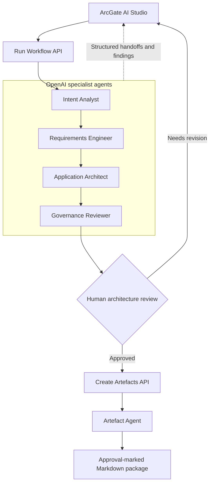

# ArcGate AI

**From business intent to governed architecture.**

ArcGate AI is a governed architecture studio for solution architects, product teams, and business stakeholders. It turns a structured business brief into a review-ready application architecture package, makes specialist-agent handoffs visible, and keeps a human approval gate before the package is released for export.

## What it solves

Architecture teams often begin with incomplete briefs, inconsistent documentation, and late governance reviews. ArcGate AI provides a single workflow that turns an outcome into a practical application proposal without treating AI output as an automatic decision.

The product helps teams:

- turn business intent into functional requirements, measurable quality attributes, architecture, and assumptions;
- make the work passed between AI specialists visible and reviewable;
- surface governance findings before approval; and
- keep a human architect accountable for approving the final package.

## True multi-agent architecture



The Run Workflow API makes one independent OpenAI Responses API call for each specialist, with role-specific prompts and strict JSON Schema responses. It passes structured output forward through the workflow and returns the handoff trace to the studio. The Create Artefacts API is unreachable from the workflow until a human has approved the governed proposal.

## Workflow

1. Define the business outcome, scale, constraints, existing systems, and preferred architecture style.
2. The Intent Analyst, Requirements Engineer, Application Architect, and Governance Reviewer run sequentially.
3. Review each visible handoff, model used, governance score, and findings.
4. Approve the proposal through the human review gate.
5. The Artefact Agent creates the approval-marked Markdown package, ready for copy or export.

## Included architecture package

- Functional requirements with MoSCoW priority
- Non-functional requirements with measurable targets
- Application architecture, modules, technology choices, integrations, and Mermaid diagram
- Explicit assumptions and governance findings

## Technology

- Next.js App Router and TypeScript
- Tailwind CSS and shadcn/ui
- OpenAI Responses API with role-specific, strict JSON Schema outputs
- Mermaid for architecture diagrams

## Run locally

```bash
npm install
cp .env.example .env.local
npm run dev -- --port 43123
```

Open [http://localhost:43123](http://localhost:43123).

## Configure OpenAI

ArcGate AI requires an OpenAI API key to generate a proposal. You can either enter a key in the studio—stored only in the current browser—or configure it locally:

```bash
OPENAI_API_KEY=your_key_here
OPENAI_MODEL=gpt-5.6-sol
```

Create API keys through the [OpenAI Platform](https://platform.openai.com/api-keys). `OPENAI_MODEL` is optional and defaults to `gpt-5.6-sol`.

Never commit `.env.local` or an API key.

## Current scope

The current release keeps its run trace and generated artefact in the active browser session. The human approval action triggers a separate artefact-generation call; persistence, organisation-level access controls, approval audit records, and long-term artefact storage are intentional future enhancements.

## Roadmap

- Persist approval records and versioned artefacts
- Add reviewer comments and approval exceptions
- Connect enterprise standards and architecture patterns as grounded sources
- Add role-based access and audit history
- Support collaboration and comparison across proposal versions
