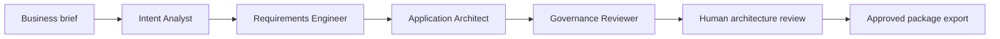

# ArcGate AI

**From business intent to governed architecture.**

ArcGate AI is a governed architecture studio for solution architects, product teams, and business stakeholders. It turns a structured business brief into a review-ready application architecture package, makes specialist-agent handoffs visible, and keeps a human approval gate before the package is released for export.

## What it solves

Architecture teams often begin with incomplete briefs, inconsistent documentation, and late governance reviews. ArcGate AI provides a single workflow that turns an outcome into a practical application proposal without treating AI output as an automatic decision.

The product helps teams:

- turn business intent into functional requirements, measurable quality attributes, architecture, and assumptions;
- make the work passed between AI specialists visible and reviewable;
- surface governance findings before approval; and
- keep a human architect accountable for approving the final package.

## Workflow



1. Define the business outcome, scale, constraints, existing systems, and preferred architecture style.
2. Generate a structured proposal with OpenAI.
3. Review the visible agent handoffs and governance findings.
4. Approve the proposal through the human review gate.
5. Export the approved architecture package as Markdown.

## Included architecture package

- Functional requirements with MoSCoW priority
- Non-functional requirements with measurable targets
- Application architecture, modules, technology choices, integrations, and Mermaid diagram
- Explicit assumptions and governance findings

## Technology

- Next.js App Router and TypeScript
- Tailwind CSS and shadcn/ui
- OpenAI Responses API with strict JSON Schema output
- Mermaid for architecture diagrams

## Run locally

```bash
npm install
cp .env.example .env.local
npm run dev -- --port 43123
```

Open [http://localhost:43123](http://localhost:43123).

## Configure OpenAI

ArcGate AI requires an OpenAI API key to generate a proposal. You can either enter a key in the studio—stored only in the current browser—or configure it locally:

```bash
OPENAI_API_KEY=your_key_here
OPENAI_MODEL=gpt-5.6-sol
```

Create API keys through the [OpenAI Platform](https://platform.openai.com/api-keys). `OPENAI_MODEL` is optional and defaults to `gpt-5.6-sol`.

Never commit `.env.local` or an API key.

## Current scope

The current release focuses on creating and reviewing architecture packages. The human approval gate updates the active session and enables export; persistence, organisation-level access controls, and long-term artefact storage are intentionally future enhancements.

## Roadmap

- Persist approval records and versioned artefacts
- Add reviewer comments and approval exceptions
- Connect enterprise standards and architecture patterns as grounded sources
- Add role-based access and audit history
- Support collaboration and comparison across proposal versions
